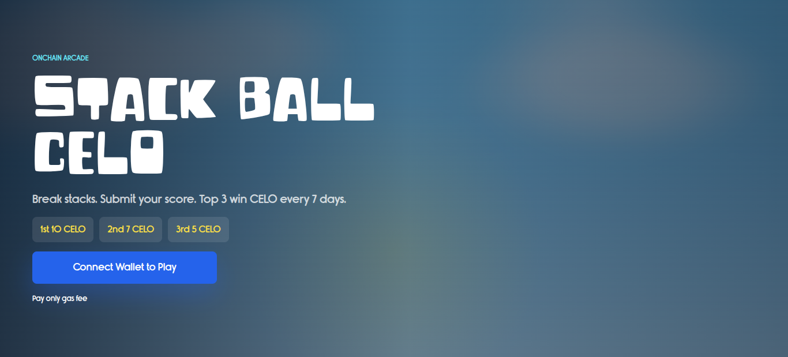
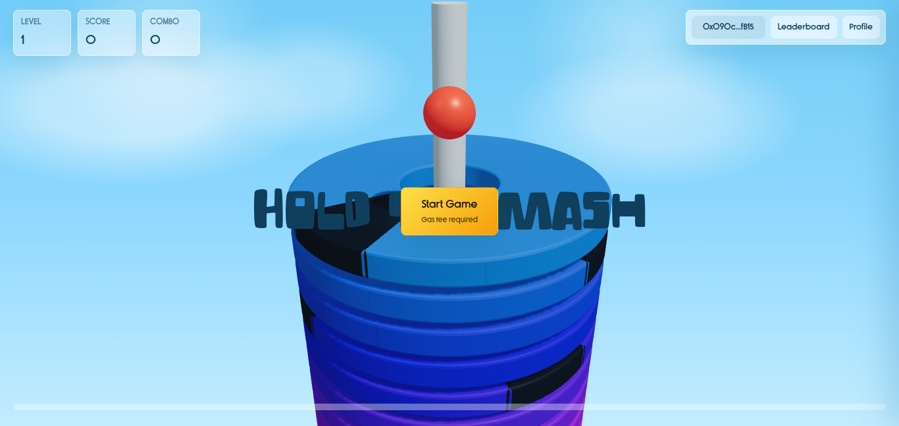
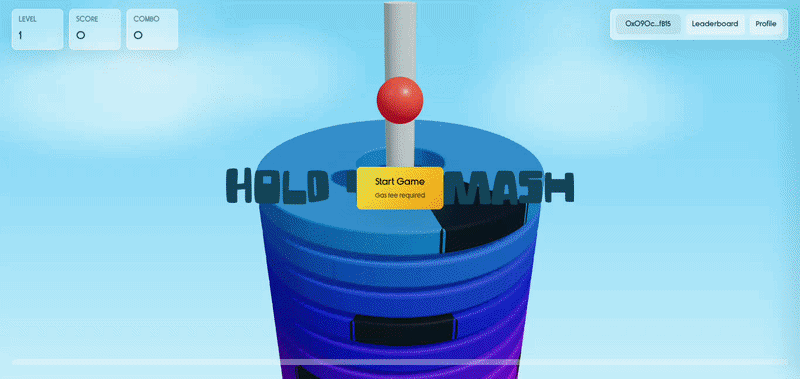

# Celo Stack Ball — Crash Stack Ball

## About the project

Celo Stack Ball is a lightweight on-chain casual game inspired by the classic "stack ball / crash" mechanics. Players drop a ball down a rotating tower and try to survive as far as possible — only paying gas to play while weekly rewards are distributed to top leaderboard players. The game is designed as a minimal on-chain demo with strong potential to become an addictive, highly replayable mobile/web game.

Built to showcase a low-cost blockchain-native play experience, this project demonstrates how simple game loops and leaderboard incentives can be combined with Celo's cheap gas and mobile-first wallet ecosystem to reach mainstream users.

## Live Demo & Links

- Live demo (Vercel): https://stackballcello-nazj.vercel.app/  
- Source (GitHub): https://github.com/hendrakurn/stackballcello  
- Contract on Celoscan: https://celoscan.io/address/0x61579782c820d63951fB1658151aDb5cC3E13288

> Replace the Vercel and GitHub links above with your actual deployment and repo URLs.

## Contract Address

- Proxy / Main contract: `0x61579782c820d63951fB1658151aDb5cC3E13288`  
- Network: Celo Mainnet (Chain ID: 42220)

## How it works & How to play

1. Connect a Celo-compatible wallet (mobile or web) to the site.  
2. Pay only the on-chain gas fee to start a round — gameplay logic runs mostly client-side with critical state/score writes recorded on-chain.  
3. Survive as many levels as possible — higher scores increase your leaderboard rank.  
4. Weekly rewards are paid to the top leaderboard addresses; players can claim rewards according to on-chain rules.

## Screenshots & Demo

### Homepage

### Gameplay

### GIF Demo

## Advantages & Why Celo
### Why CrasgStackBall stands out:
- Truly onchain gameplay — score submission, leaderboard ranking, and reward distribution are all recorded and executed on-chain, not just claimed to be. Every game session is verifiable on Celoscan.
- Ultra-low barrier to play — players only pay gas to start a game and submit a score. No token purchase, no NFT required, no signup. Just connect a wallet and play.
- Weekly CELO rewards — native CELO is distributed automatically to top leaderboard players via smart contract, with no intermediary and no manual payout process.
- Anti-cheat by design — the contract enforces minimum game duration (10 seconds), submit cooldown (30 seconds), and unique game hashes per session, making score manipulation significantly harder than traditional leaderboard games.
- Upgradeable architecture — built with ERC1967 proxy pattern, allowing the game to evolve and improve without redeploying or breaking existing player data.

### Why Celo:
- Extremely low gas fees for players — the game is playable with minimal friction.  
- Native CELO integrations make reward distribution and payments simple.  
- Mobile-first ecosystem and phone-friendly wallets increase accessibility to mainstream users.

## Tech Stack

- Frontend: Next.js (React)  
- Smart contracts: Solidity, Foundry (development & testing)  
- Wallet + dApp integration: wagmi and Celo-compatible wallet adapters  
- Chain: Celo Mainnet (42220)  
- Hosting / Deployment: Vercel

## Roadmap / Next Steps

- Polish gameplay loop and add analytics to track retention.  
- Add tokenized rewards, seasonal tournaments, and referral incentives.  
- Mobile optimizations and native app wrappers.  
- Expand on-chain features (NFTs, stakes, progressive jackpots) while keeping gas costs minimal.

